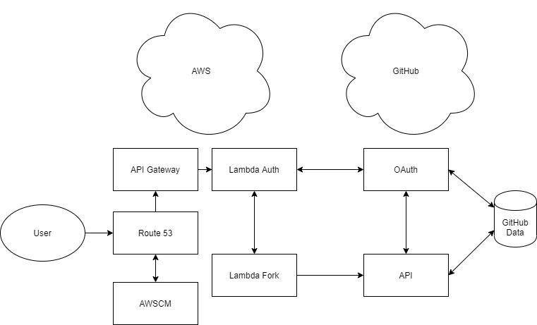

# HealthJoy
The purpose of this exercise is to provide a method to fork GitHub repositories. This implies that we use some form of authentication and use of their API. While there is another method (via [button creation](https://buttons.github.io/)) that would defeat the purpose of this assignment.

## GitHub Resources
* OAuth integration
* api.github.com

## AWS Resources
* Route 53
* API Gateway
* AWS Certificate Manager
* Lambdas

## Implementation
A user would visit the service page located at [https://healthjoy.lucis.works/fork](https://healthjoy.lucis.works/fork) and would be redirected to authenticate at [https://healthjoy.lucis.works/auth](https://healthjoy.lucis.works/auth). This page has a short description of what the service does and provides a link for the user to authorize the service to make actions on their behalf through GitHub's OAuth Apps. Once we receive the user's access token (with the 'repo' scope) we can proceed to fork this project repository or any other repo they have access to. This service currently handles all basic success and failure scenarios, along with a few edge cases found during development.

## Development Notes
* In place of a traditional router like Flask or AIOHTTP I instead use API Gateway to proxy to lambdas. Each lambda handles a separate route or path.
* Inline HTML/CSS/JS used instead of a templating engine like Mustache/Chevron due to minimal use, although if more complex it would be a matter of packaging that to use in a layer with the lambdas.
* This method also works well with serving static files via S3 bucket or CDN.
* Can also integrate this with [SAM](https://aws.amazon.com/serverless/sam/) to handle configuration and deployment via YAML file, although a project of this scope was simpler to configure via AWS Console.
* Used Python 3 in lambdas, although JavaScript would also have handled this in just about the same way.
* Using latest  [GitHub OAuth](https://docs.github.com/en/developers/apps/authorizing-oauth-apps) and [API](https://docs.github.com/en/rest/reference/repos) practices.